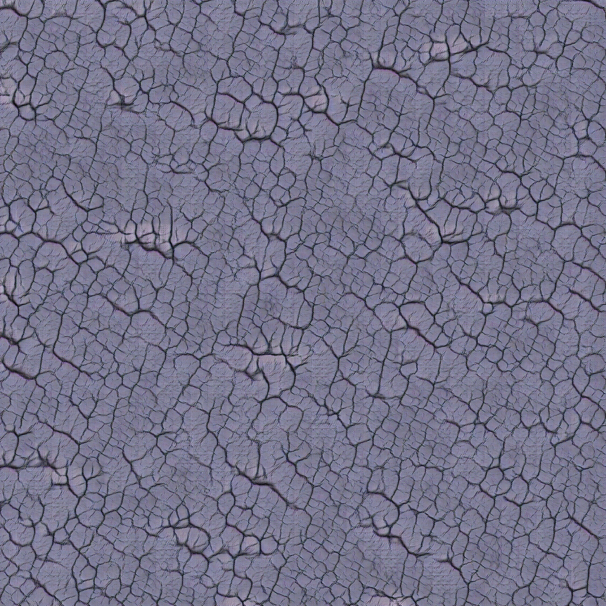
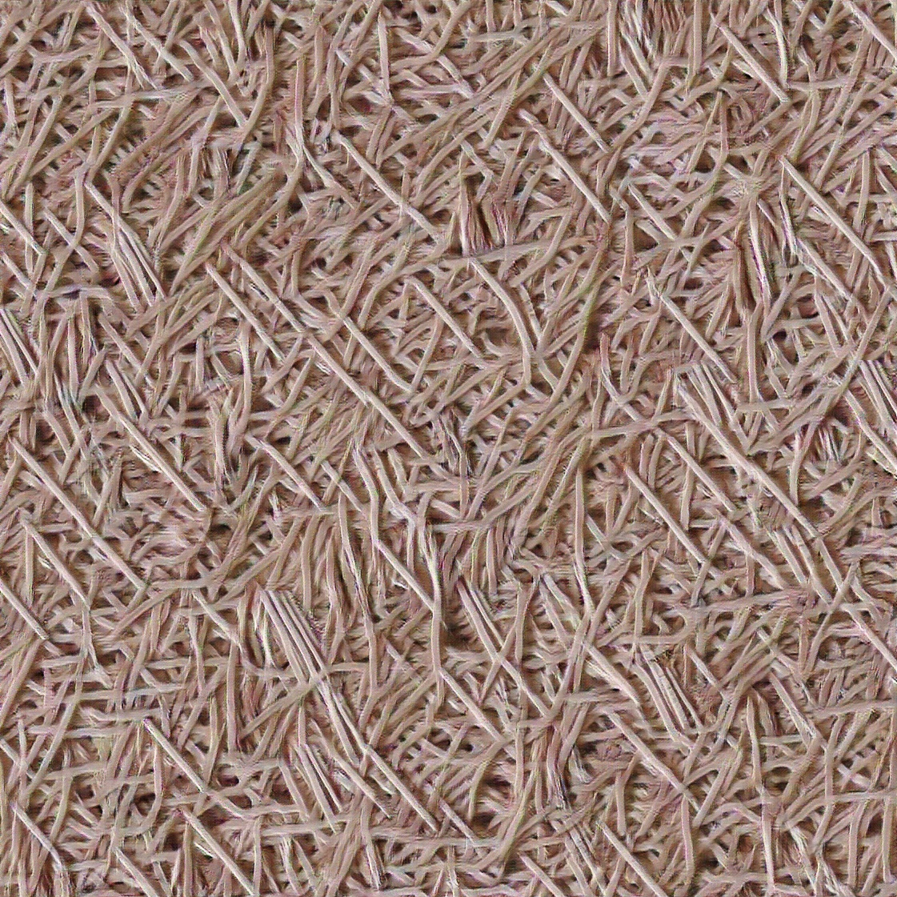
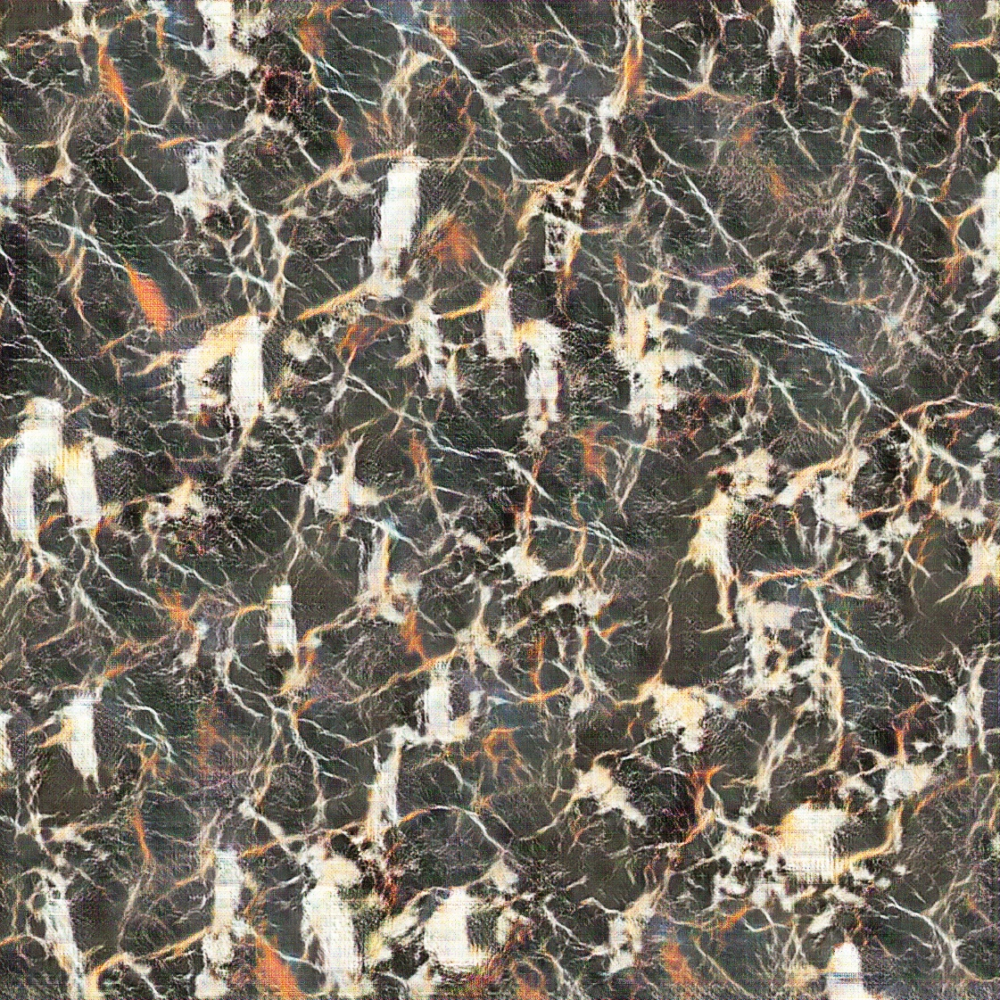
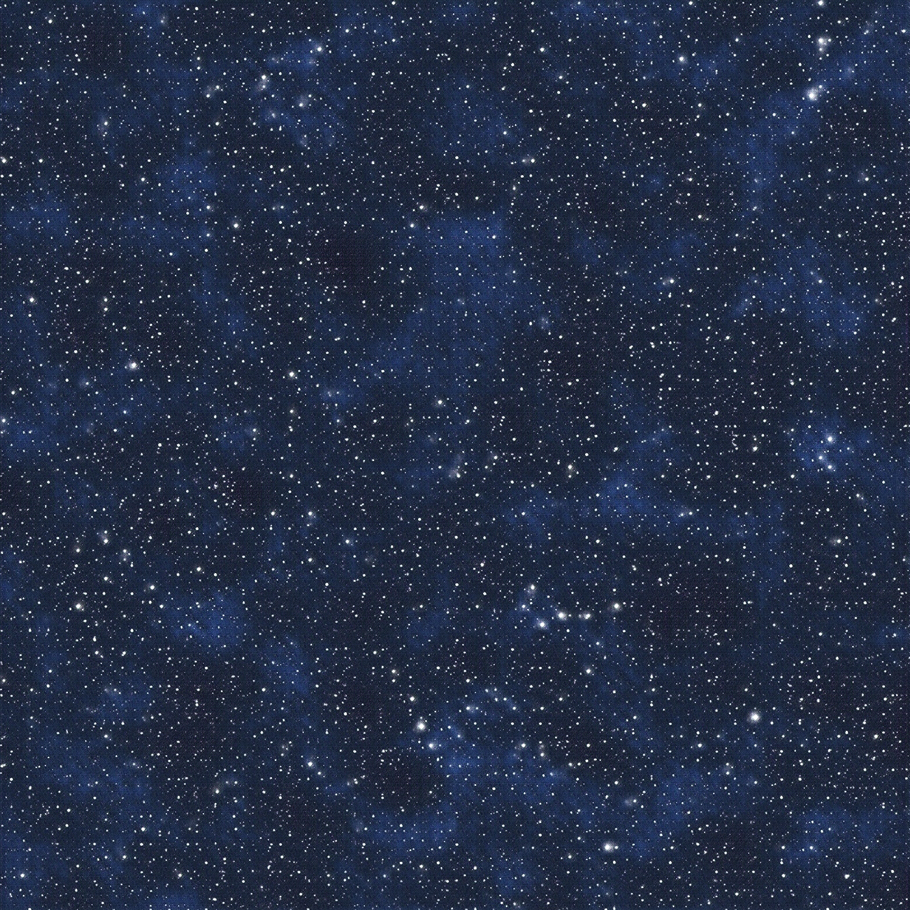
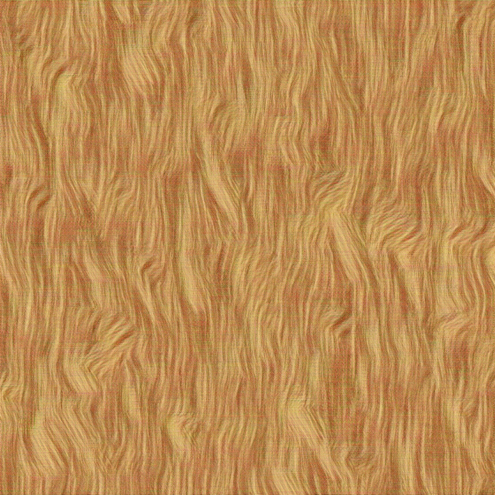

# 790-Project
This project consists of three parts: STGAN, MTGAN and SGAN

## SGAN
SGAN is written in tensorflow, but the model structure has some references to the original Theano implementation: 
https://github.com/zalandoresearch/spatial_gan  
Except the OS modules, image processing functions and the flags set-ups, most codes are written by myself.

To use SGAN, simpy run python run.py  
You must have a directory called dataset that has all training samples in it.  
To change parameters, use --   For example, python run.py --spatial_size=7 
To generate images from pretrained models, use python run.py --training=False --model_dir="<The directory where your models are in>"
  
Here are some good samples:

